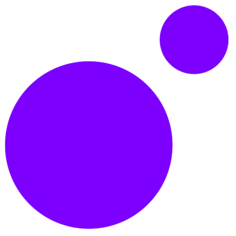

<code></img></code> Hey there 👋 I'm Leo and I'm currently a Senior Data Engineer

#### Some tools and languages I'm in experienced in 🧠
<code></code>
<code></code>
<code></code>
<code></code>
<code></code>
<code></code>
<code></code>
<code></code>

#### Some other tools I'm developing experience in 🚧
<code></code>
<code></code>
<code></code>

# Some projects you should check out:
- [Personal Website](https://github.com/thesammy2010/thesammy2010.com)
- [Terraform Infrastructure Management](https://github.com/thesammy2010/terraform)

### Companies
</img> [MoonPay](https://moonpay.com)
</img> [Curve](https://curve.com)

### Contact Me
- 
- [Email](mailto:info@thesammy2010.com)
