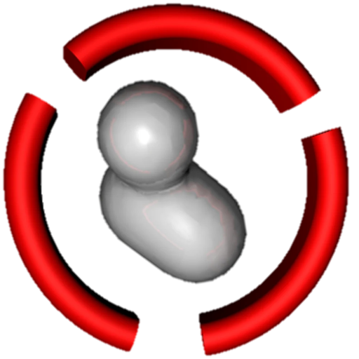
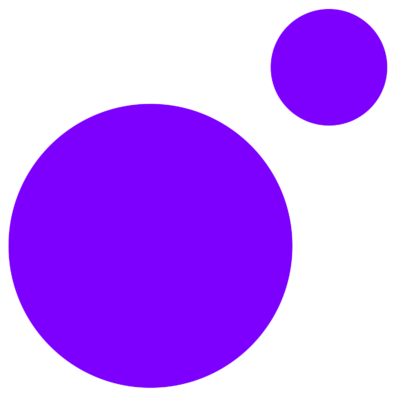

<div align="center">

</img>

# Hey there 👋 I'm Leo

**Senior Data Engineer** · London, United Kingdom

Mostly Python, Terraform and streaming data. Currently at
[Blockchain.com](https://blockchain.com), building things on
[thesammy2010.com](https://thesammy2010.com) in my own time.

[](https://thesammy2010.com)
[](https://www.linkedin.com/in/leo-pn/)
[](mailto:info@thesammy2010.com)

</div>

---

## 🧠 Tools and languages I'm experienced in

<table>
  <tr>
    <td align="center" width="110">
      <br>Python
    </td>
    <td align="center" width="110">
      <br>SQL
    </td>
    <td align="center" width="110">
      <br>Kotlin
    </td>
    <td align="center" width="110">
      <br>TypeScript
    </td>
    <td align="center" width="110">
      <br>Terraform
    </td>
    <td align="center" width="110">
      <br>dbt
    </td>
    <td align="center" width="110">
      <br>Kubernetes
    </td>
  </tr>
  <tr>
    <td align="center" width="110">
      <br>Docker
    </td>
    <td align="center" width="110">
      <br>GCP
    </td>
    <td align="center" width="110">
      <br>PostgreSQL
    </td>
    <td align="center" width="110">
      <br>Kafka
    </td>
    <td align="center" width="110">
      <br>Redpanda
    </td>
    <td align="center" width="110">
      <br>Actions
    </td>
  </tr>
</table>

## 🚧 Tools I'm developing experience in

<table>
  <tr>
    <td align="center" width="110">
      <br>Go
    </td>
    <td align="center" width="110">
      <br>Rust
    </td>
    <td align="center" width="110">
      <br>React
    </td>
    <td align="center" width="110">
      <br>GraphQL
    </td>
    <td align="center" width="110">
      <br>FastAPI
    </td>
  </tr>
</table>

---

## 🛠️ Projects

<!-- The table below is regenerated by .github/workflows/update-readme.yml.
     Anything typed between the START and END markers will be overwritten. -->
<!-- PROJECTS:START -->
| Project | What it is | Stack | Last pushed |
| --- | --- | --- | --- |
| [api.thesammy2010.com](https://github.com/thesammy2010/api.thesammy2010.com) | — | Python | yesterday |
| [thesammy2010.com](https://github.com/thesammy2010/thesammy2010.com) | Repo for thesammy2010.com | TypeScript | yesterday |
| [terraform](https://github.com/thesammy2010/terraform) | Terraform Code | HCL | 2 days ago |
| [coded-animations](https://github.com/thesammy2010/coded-animations) | Tested using coded animations | Python | 2 days ago |
<!-- PROJECTS:END -->

## 📊 GitHub

<!-- PROJECTS:START/END above and LANGUAGES below are both generated from the
     GitHub API, so they never go stale and never 404 the way the third party
     stats-card services do. -->
<!-- LANGUAGES:START -->
```text
TypeScript  ██████████████░░░░░░░░░░░░░░   51.1%
Python      ██████████░░░░░░░░░░░░░░░░░░   35.4%
CSS         ███░░░░░░░░░░░░░░░░░░░░░░░░░   11.6%
HCL         ░░░░░░░░░░░░░░░░░░░░░░░░░░░░    1.5%
HTML        ░░░░░░░░░░░░░░░░░░░░░░░░░░░░    0.4%
```

<sub>Across my public repositories, by bytes of code.</sub>
<!-- LANGUAGES:END -->

<div align="center">

[](https://git.io/streak-stats)

</div>

---

## 🏢 Companies

<table>
  <tr>
    <td width="34"></td>
    <td><a href="https://blockchain.com">Blockchain.com</a></td>
    <td><em>Senior Data Engineer — current</em></td>
  </tr>
  <tr>
    <td width="34"></td>
    <td><a href="https://moonpay.com">MoonPay</a></td>
    <td></td>
  </tr>
  <tr>
    <td width="34"></td>
    <td><a href="https://curve.com">Curve</a></td>
    <td></td>
  </tr>
  <tr>
    <td width="34"></td>
    <td><a href="https://dice.fm">dice.fm</a></td>
    <td></td>
  </tr>
</table>

---

<div align="center">
<sub>Company logos are the trademarks of their respective owners and are used here for identification only.</sub>
</div>
